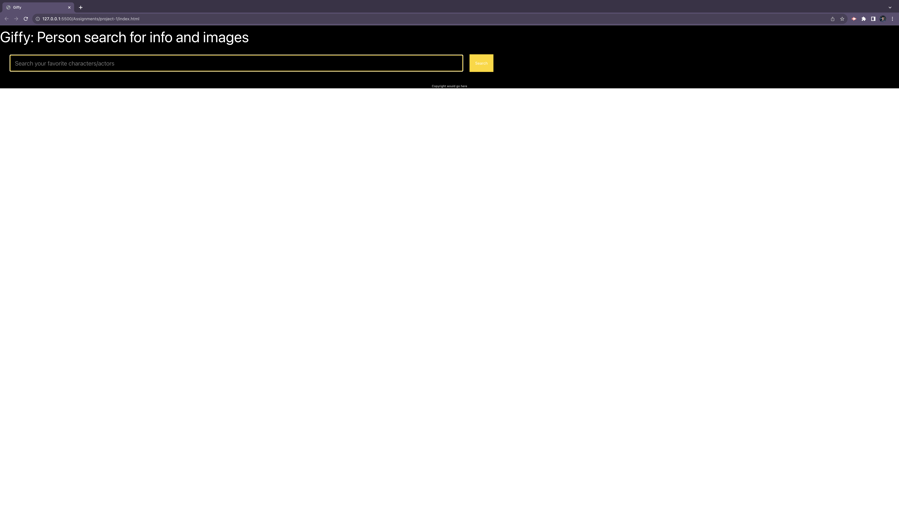

# project-1
project 1 for bootcamp(collaborative)

## Description
This Web Application's purpsose is to search for an item that has gifs and for infomrmation about the search item. It pulls from Wikiapedia's API for the information and Giphy's API for the gifs. 

Github Link:
https://github.com/jessclark1234/project-1 

Live App Link:

This is what the website looks like when at first loaded. ^

This is what the site looks like when an item is searched and displayed with the results. ^
## Usage
This Web Application's usage is to assist users looking for information about a gif that they are looking for. 
## Credits
Christina Sullivan

Jessica Clark

Martin Castaneda

Sam Gillam

## License

MIT License

Copyright (c) 2023 jessclark1234

Permission is hereby granted, free of charge, to any person obtaining a copy
of this software and associated documentation files (the "Software"), to deal
in the Software without restriction, including without limitation the rights
to use, copy, modify, merge, publish, distribute, sublicense, and/or sell
copies of the Software, and to permit persons to whom the Software is
furnished to do so, subject to the following conditions:

The above copyright notice and this permission notice shall be included in all
copies or substantial portions of the Software.

THE SOFTWARE IS PROVIDED "AS IS", WITHOUT WARRANTY OF ANY KIND, EXPRESS OR
IMPLIED, INCLUDING BUT NOT LIMITED TO THE WARRANTIES OF MERCHANTABILITY,
FITNESS FOR A PARTICULAR PURPOSE AND NONINFRINGEMENT. IN NO EVENT SHALL THE
AUTHORS OR COPYRIGHT HOLDERS BE LIABLE FOR ANY CLAIM, DAMAGES OR OTHER
LIABILITY, WHETHER IN AN ACTION OF CONTRACT, TORT OR OTHERWISE, ARISING FROM,
OUT OF OR IN CONNECTION WITH THE SOFTWARE OR THE USE OR OTHER DEALINGS IN THE
SOFTWARE.